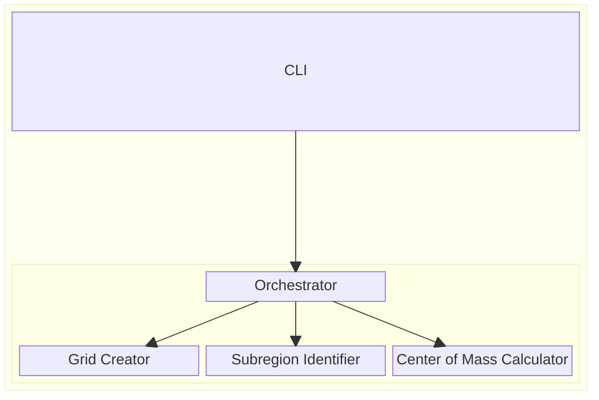

Title: Component Identification & Architecture Scope
Number: 0002
Decision Date: 11/9/2024
State: Active
Supersedes: 
Superseded by:

# Description

Component Identificaiton deals with understanding the modular parts of a solution. These components could be delivered as part of a modular monolith, microservices or some other design.

Architecture Scope identifies the smallest deployable part of the solution. In the case of a monolith, the entire monolith is the architectural scope. Individual microservices are each their own Architecture Scope. The Architecture Scope of a system will affect various decisions such as how to scale a solution, the communication requirements between components, data storage, etc.

# Options

## Option 1: CLI

Components:
- Orchestrator
- Grid Creator
- Subregion Identifier
- Center of Mass Calculator

Architecture Scope: Deploy the solution as a Command Line Interface with these containers:
- CLI
- Core Library, where components are separate classes

## Option 2: Web Application with Microservices

Components:
- Orchestrator
- Grid Creator
- Subregion Identifier
- Center of Mass Calculator

Architecture Scope: Deploy each component as a microservice. Include a web application with an API Gateway as the backend.

# Selected Option

Option 1: CLI

The initial release of GridR is a Command Line Interface. There are no special requirements that the components of the application need to be physically deployed separately.

There are currently no data storage requirements nor any reason for communication outside of the core components.